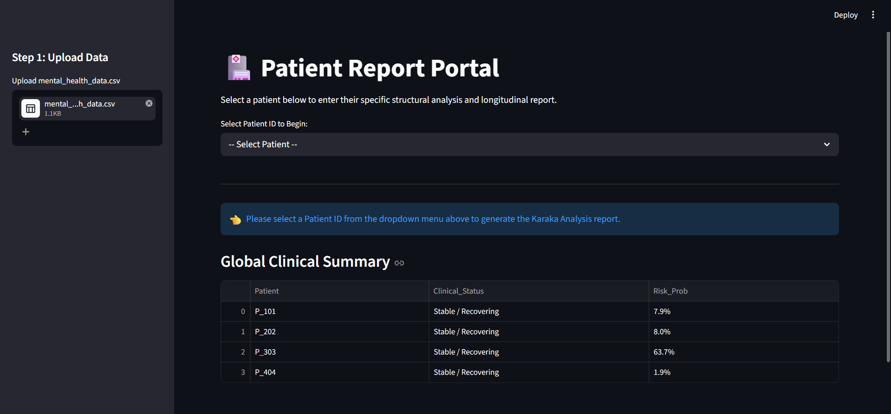
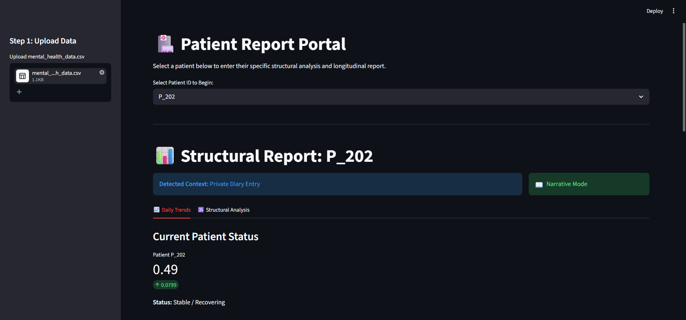
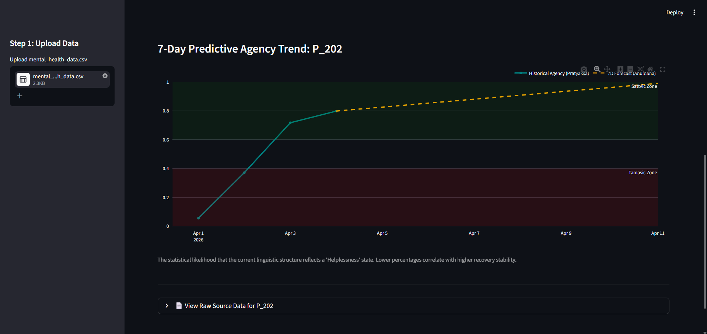
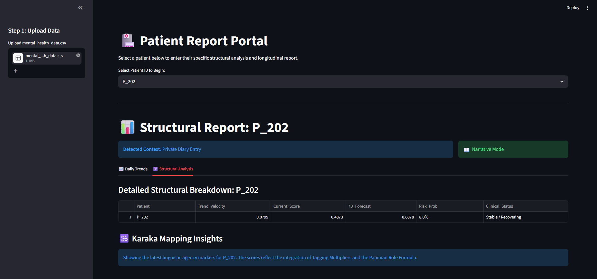

# Mental-Health-Analysis-System-Based-on-Sanskrit-Role-Tagging
A Streamlit-based analytics project for monitoring longitudinal mental health trends from text data. It combines Natural Language Processing, Dependeny Parsing, Time-series Analysis, and Sanskrit-inspired Structural Linguistics (Karaka Theory) to generate patient-level insights from journal, therapy or clinical entries.

## Features
- Domain Detection (Diary/ Therapy/Clinical) using Transformers
- Karaka-based Structural Sentiment Analysis
- Longitudinal Tracking of patient mental state
- Patient-specific reports and charts
- 7-Day Predictive Trend Visualization
- Confidence-weighted Risk Prediction using Exponential Regression
- Interactive dashboard using Streamlit

## Technology Stack
- **Programming Language:** Python  
- **Frontend/UI:** Streamlit  
- **Natural Language Processing:** spaCy, Hugging Face Transformers, TextBlob
- **Machine Learning:** scikit-learn  
- **Data Handling:** Pandas, NumPy  
- **Data Visualization:** Matplotlib, Seaborn, Plotly
- **Deep Learning Backend:** PyTorch  

## Installation
1. Clone the repository.
   git clone https://github.com/Vaanya-Gupta700/Mental-Health-Analysis-System-Based-on-Sanskrit-Role-Tagging.git  
   cd Mental-Health-Analysis-System-Based-on-Sanskrit-Role-Tagging
2. Install dependencies:  
   python -m pip install -r requirements.txt
3. Install spaCy model:  
   python -m spacy download en_core_web_md
4. Run the app:  
   python -m streamlit run app.py
5. After running the command, open the local URL shown in the terminal.

## Input Dataset Format
Required CSV columns:  
Patient_ID, Date, Text_Column

Example:  
P_101,2026-04-01,"I feel overwhelmed today."  
P_101,2026-04-02,"I am taking control again."

## Output
- Patient dashboard reports
- Historical + 7-day forecast trend graph
- Dominance score summaries
- Risk probability estimates
- Structural sentiment tables

## Predicitve Modeling Logic
The system uses Exponentially Weighted Linear Regression to forecast a patient's mental state:

- Recent data points are given higher importance
- Forecast is adjusted using confidence-based smoothing
- Outputs include:  
Trend velocity  
7-day forecast  
Risk probability  
Clinical status classification

## Demo

## Project Contributors
Anshika  
Prachi Aggarwal  
Rashmi  
Urmee Kali  
Vaanya Gupta  

